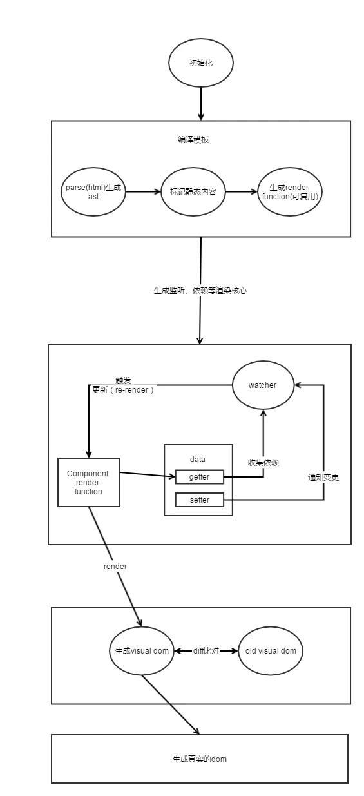
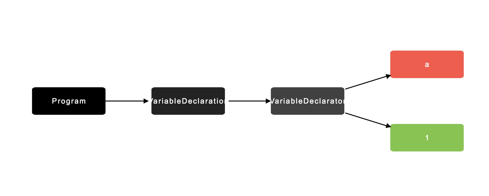

# 前端模板的演变

### 1、 直接操作dom

页面的构建，总是离不开对dom的直接操作

```javascript
var div = document.createElement('div')
var p = document.createElement('p')
p.innerText = 'Hello World'
div.appendChild(p)
document.body.appendChild(div)
```

缺点：

1. 频繁对 *dom* 进行访问/操作，性能变差
2. 每次的更改比较麻烦


### 2、Micro-Templating

为了解决这种麻烦的操作方式，*jQuery* 的作者 [ *John Resig* ] 写了一个小型的[Micro-Templating](https://johnresig.com/blog/javascript-micro-templating/)

模板的使用语法:

```html
<script type="text/html" id="item_templ">
	<div id="<%=id%>" class="<%=(i % 2 == 1 ? " even" : "")%>">
      <div class="grid_1 alpha right">
        "/>
      </div>
      <div class="grid_6 omega contents">
        <p><b><a href="/<%=from_user%>"><%=from_user%></a>:</b> <%=text%></p>
      </div>
    </div>  
</script>
```

#### 2.1 Micro Template 实现代码

```javascript
// Simple JavaScript Templating

// John Resig - https://johnresig.com/ - MIT Licensed

(function(){

  var cache = {};

   

  this.tmpl = function tmpl(str, data){

    // Figure out if we're getting a template, or if we need to

    // load the template - and be sure to cache the result.

    var fn = !/\W/.test(str) ?

      cache[str] = cache[str] ||

        tmpl(document.getElementById(str).innerHTML) :

       

      // Generate a reusable function that will serve as a template

      // generator (and which will be cached).

      new Function("obj",

        "var p=[],print=function(){p.push.apply(p,arguments);};" +

         

        // Introduce the data as local variables using with(){}

        "with(obj){p.push('" +

         

        // Convert the template into pure JavaScript

        str

          .replace(/[\r\t\n]/g, " ")

          .split("<%").join("\t")

          .replace(/((^|%>)\t*)'/g, "$1\r")

          .replace(/\t=(.*?)%>/g, "',$1,'")

          .split("\t").join("');")

          .split("%>").join("p.push('")

          .split("\r").join("\'")

      + "');}return p.join('');");

     

    // Provide some basic currying to the user

    return data ? fn( data ) : fn;

  };

})();

```


**2.1.1 主要知识点：**

1. [new Function](https://developer.mozilla.org/zh-CN/docs/Web/JavaScript/Reference/Global_Objects/Function): 用于创建一个将模板解析成 *html* 字符串并且结合 *data* 的函数  *fn*，通过  *fn(data)*  传入模板中用到的全局 *data*。


1. [with](https://developer.mozilla.org/zh-CN/docs/Web/JavaScript/Reference/Statements/with): 传入的 *data* 作为函数体中 *obj* 的变量取值，也可声明一个临时变量来存值，达到一样的效果。


1. 正则表达式对字符串进行切割 如识别到模板语法中的 *<%* 替换成 *\t*

**2.1.2 存在的问题：**

1. 代码调试痛苦，不方便定位问题

2. 无法将数据与状态绑定，每次数据的更改需要更新整个视图层

   ​

### 3. Vue的模板实现学习

> Vue的使用非常的简单，根据官方文档可以快速的入门，但是本着不能只知道如何使用，而不知道是如何起作用的原则，了解一下Vue的实现机制

#### 3.1 Vue核心执行过程图



可以看出在拿到模板后首先要编译模板，生成  *AST* ( *Abstract Syntax Tree* ) 抽象对象树，即源代码的抽象语法树的结构的表示，并不会表示出具体的代码实现细节，也不依赖于源代码的语法，树上的每个节点映射出源代码中的一种结构

> **什么是抽象语法树**
> 抽象语法树(Abstract Syntax Tree) 是源代码语法结构的抽象表示，并以树这种数据结构进行描述。AST 属编译原理范畴，有比较成熟的理论基础，因此被广泛运用在对各种程序语言（JavaScript, C, Java, Python等等）的编译处理中。Vue 同样也是使用 AST 作为中间形式完成对 html 模板的编译。

在继续Vue原理之前，需要先了解 *AST* 构建的一般过程

**3.1.1 AST 示例**

比如：

```javascript
let a = 1;
```

生成的 *AST* 格式如下:

```javascript
{
    type: "Program",
    body: [
        {
            type: "VariableDeclaration",
            declarations: [
                {
                    type: "VariableDeclarator",
                    id: {
                        type: "Identifier",
                        name: "a"
                    },
                    init: {
                        type: "Literal",
                        value: 1,
                        raw: "1"
                    }
                }
            ],
            kind: "let"
        }
    ],
    sourceType: "script"
}
```

*AST* 图形预览:



[在线生成 *AST* 结构工具](http://astexplorer.net/)                 [在线生成 *AST* 图形工具](http://resources.jointjs.com/demos/javascript-ast)


**3.1.2 Vue中AST的实现**

